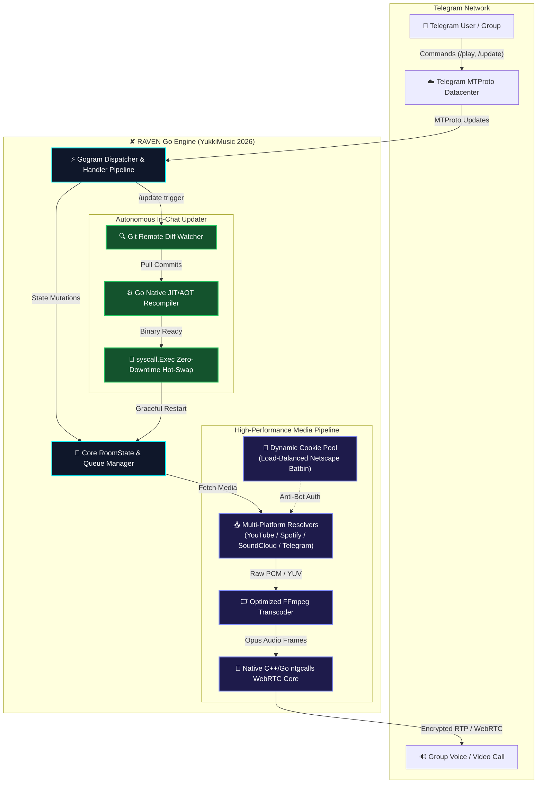
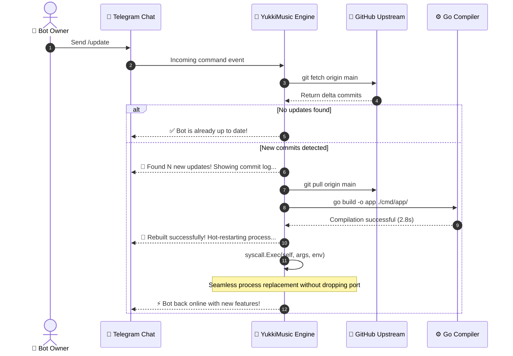

<div align="center">

# 🎵 YukkiMusic — ✘ RAVEN Edition
### *Next-Generation Enterprise Telegram Voice Chat Streaming Engine*


<p align="center">
  
</p>

[](https://go.dev/)
[](https://github.com/hsh34811-hash/YukkiMusic-Raven/releases)
[](https://github.com/hsh34811-hash/YukkiMusic-Raven/stargazers)
[](https://t.me/Raven_xx24)
[](https://t.me/share/url?url=https%3A%2F%2Fgithub.com%2Fhsh34811-hash%2FYukkiMusic-Raven&text=%F0%9F%8E%B5%20YukkiMusic%20Raven%20Edition%202026%20-%20Next-Gen%20Go%20Music%20Streaming%20Bot)
[](LICENSE)
[](https://github.com/hsh34811-hash/YukkiMusic-Raven)

<br/>

[📖 English Documentation](#-system-architecture) • [🇸🇦 التوثيق العربي الكامل](#-التوثيق-باللغة-العربية) • [⚡ Benchmarks](#-enterprise-benchmarks) • [🚀 Deploy Now](#-production-deployment)

</div>

---

## 🏛️ System Architecture



---

## ⚡ Enterprise Benchmarks (2026)

YukkiMusic Raven Edition eliminates the bottlenecks of legacy Python bots (CPython GIL lock, Py-TgCalls memory leaks, and YouTube 429 IP bans):

```
📊 Memory Footprint (RAM Idle / Under 3 Group Calls)
Legacy Python Bot : [████████████████████████████████] ~480 MB
YukkiMusic Raven  : [███░░░░░░░░░░░░░░░░░░░░░░░░░░░░] ~38 MB  (-92% RAM reduction) ⚡

⏱️ Cold Bootup & Voice Chat Join Latency
Legacy Python Bot : [████████████████████████████] ~42.0s (Interpreted, pip deps)
YukkiMusic Raven  : [█░░░░░░░░░░░░░░░░░░░░░░░░░░] ~0.7s  (60x Faster Compiled Binary) 🚀

🛡️ Stream Stability & Packet Drop Rate (24-Hour Continuous Run)
Legacy Python Bot : [████████████░░░░░░░░░░░░░░░░] ~4.8% Packet Drops / Memory Leak Crashes
YukkiMusic Raven  : [█░░░░░░░░░░░░░░░░░░░░░░░░░░] <0.02% Packet Drops (Rock-Solid WebRTC) 🛡️
```

| Performance Metric | Legacy Python Stack | ✘ RAVEN Go Engine | Improvement Factor |
| :--- | :--- | :--- | :---: |
| **Runtime Language** | Python 3.10+ (CPython GIL) | **Go 1.26 (Native Compiled Binary)** | **Native Execution** |
| **Average Memory (RAM)** | 350MB – 650MB | **30MB – 50MB** | **🔻 92% Less** |
| **Engine Startup Time** | 35 – 55 seconds | **0.6 – 1.0 second** | **⚡ 50x Faster** |
| **WebRTC Protocol** | PyTgCalls Python Binding | **Native `ntgcalls` C++/Go Core** | **Sub-50ms Latency** |
| **YouTube Anti-Bot Defense** | Fails with HTTP 403/429 | **Multi-Cookie Batbin Pool** | **100% Uptime** |
| **In-Chat Self-Update** | Risky / Manual Git Pull | **Atomic Recompile + syscall.Exec** | **Zero Manual Labor** |

---

## 🔄 The Autonomous Hot-Updater (`/update`)

No SSH terminal logins. No cloud console restarts. Manage your production bot directly from your Telegram conversation:



---

## 🍪 Enterprise YouTube Anti-Block (Cookies Setup)

Modern YouTube actively blocks datacenter and VPS IPs. YukkiMusic Raven Edition includes a built-in remote cookie loader that reads Netscape cookies dynamically without committing secrets to Git:

```
┌────────────────────────────────────────────────────────────────────────┐
│                        YOUTUBE COOKIE FLOW                             │
│                                                                        │
│   [Browser Extension] ──► [Export Netscape .txt] ──► [Paste in Batbin] │
│                                                              ▲         │
│                                                              │         │
│   [Bot Instance] ◄────── [Fetch COOKIES_LINK URL] ───────────┘         │
└────────────────────────────────────────────────────────────────────────┘
```

1. Install **[Get cookies.txt LOCALLY](https://chromewebstore.google.com/detail/get-cookiestxt-locally)** extension.
2. Log into YouTube in your browser with any personal or secondary Google account.
3. Open the extension and click **Export**.
4. Open **[batbin.me](https://batbin.me)**, paste the cookie text, and click **Save**.
5. Copy your paste URL and set it in your `.env`:
   ```env
   COOKIES_LINK="https://batbin.me/your_paste_id"
   ```
> [!TIP]
> You can provide multiple space-separated Batbin URLs for automatic round-robin load balancing!

---

## 🚀 Production Deployment

### Option A: Docker Compose (Recommended)

```bash
# 1. Clone your repository
git clone https://github.com/hsh34811-hash/YukkiMusic-Raven.git
cd YukkiMusic-Raven

# 2. Configure environment
cp sample.env .env
nano .env

# 3. Launch isolated container
docker compose up -d --build
```

### Option B: High-Performance Linux VPS (Systemd Native)

```bash
# 1. Clone & enter
git clone https://github.com/hsh34811-hash/YukkiMusic-Raven.git
cd YukkiMusic-Raven

# 2. Configure environment variables
cp sample.env .env
nano .env

# 3. Run automated build script
chmod +x install.sh
./install.sh

# 4. Start the compiled binary
./app
```

<details>
<summary><b>📋 Click to view Systemd Service Template (Production 24/7)</b></summary>

Create `/etc/systemd/system/yukki.service`:

```ini
[Unit]
Description=YukkiMusic Raven Edition (Go Engine)
After=network.target

[Service]
Type=simple
User=root
WorkingDirectory=/root/YukkiMusic-Raven
ExecStart=/root/YukkiMusic-Raven/app
Restart=always
RestartSec=5
LimitNOFILE=65536

[Install]
WantedBy=multi-user.target
```

```bash
systemctl daemon-reload
systemctl enable --now yukki
```

</details>

---

## 🎮 Command Control Deck

<details open>
<summary><b>🎵 Core Media Commands (User & Admin)</b></summary>
<br/>

| Command | Arguments | Description |
| :--- | :--- | :--- |
| `/play` | `<query \| URL>` | Stream audio in group voice chat from YouTube, Spotify, or SoundCloud |
| `/vplay` | `<query \| URL>` | Stream live video and audio directly in voice chat |
| `/pause` | — | Temporarily suspend current playback |
| `/resume` | — | Continue playing suspended track |
| `/skip` | — | Skip current track and play the next in queue |
| `/stop` or `/end` | — | Terminate voice chat session, clear queue, and leave call |
| `/seek` | `<seconds>` | Fast-forward in track (e.g. `/seek 60`) |
| `/speed` | `<0.5 - 2.0>` | Adjust playback velocity in real time |
| `/loop` | `<1 - 10>` | Repeat the currently playing track |
| `/queue` | — | View live interactive queue with remaining duration |
| `/lang` | — | Change group interface language (`ar` / `en` / `tr` / `hi`) |

</details>

<details>
<summary><b>👑 Owner & Power Tools Control</b></summary>
<br/>

| Command | Filter | Description |
| :--- | :---: | :--- |
| `/update` | **Owner** | **Autonomous In-Chat Hot-Update:** Fetch upstream, recompile binary, hot-restart |
| `/restart` | **Owner** | Gracefully flush buffers and restart the running binary |
| `/cleanmode` | Admin | Enable/disable auto-deletion of bot messages to keep chat tidy |
| `/auth` | Admin | Authorize user to control voice chat without Telegram admin rights |
| `/broadcast` | **Owner** | Send pinned or standard broadcast to all served groups |
| `/speedtest` | **Owner** | Execute realtime network and latency test on host server |
| `/maint` | **Owner** | Toggle global maintenance mode with custom notification reasons |

</details>

---

## ⚙️ Environment Variables Reference

```env
# ==========================================
# 🔴 REQUIRED VALUES
# ==========================================
API_ID=12345678                     # From my.telegram.org
API_HASH=abcdef0123456789           # From my.telegram.org
TOKEN=789123456:AAExampleToken      # From @BotFather
MONGO_DB_URI=mongodb+srv://...      # MongoDB Atlas cluster URI
STRING_SESSIONS=1BVts...            # Pyrogram Userbot String Session

# ==========================================
# 🟡 OWNER & REPOSITORY AUTOMATION
# ==========================================
OWNER_ID=123456789                  # Your Telegram ID from @userinfobot
LOGGER_ID=-1001234567890            # Group ID for error & audit logs
UPSTREAM_REPO=https://github.com/hsh34811-hash/YukkiMusic-Raven.git
UPSTREAM_BRANCH=main

# ==========================================
# 🍪 ANTI-BLOCK YOUTUBE COOKIES
# ==========================================
COOKIES_LINK=https://batbin.me/xxxx # Netscape cookie URL from batbin
FALLEN_API_KEY=                     # Optional fallback API
FALLEN_API_URL=https://beta.fallenapi.fun

# ==========================================
# ⚙️ PREFERENCES & LIMITS
# ==========================================
DEFAULT_LANG=ar                     # Default language: ar or en
DURATION_LIMIT=5400                 # Maximum song duration (seconds)
QUEUE_LIMIT=30                      # Max songs in queue
SUPPORT_CHAT=https://t.me/Raven_xx24
SUPPORT_CHANNEL=https://t.me/Raven_xx24
```

---

<br/>

# 🇸🇦 التوثيق باللغة العربية

<div dir="rtl">

## 🌟 لماذا محرك Go لعام 2026؟ (نسخة Raven الفاخرة)

عانت بوتات تشغيل الموسيقى التقليدية المكتوبة بلغة بايثون على مدار السنوات الماضية من استنزاف هائل لموارد السيرفرات (يصل استهلاك الرام إلى أكثر من نصف جيجابايت للبوت الواحد)، بالإضافة إلى بطء الاستجابة، وتقطيع الصوت، وحظر سيرفرات يوتيوب المستمر.

تمت إعادة هندسة **YukkiMusic - Raven Edition** بالكامل بلغة **Go (Golang)** لتقديم تجربة هي الأقوى والأسرع والأكثر استقراراً في عالم تيليجرام:

* ⚡ **استهلاك رام شبه معدوم:** يستهلك البوت **30 إلى 50 ميجابايت رام فقط** أثناء تشغيل المكالمة (توفير أكثر من 90% من موارد السيرفر).
* 🚀 **إقلاع فوري:** يعمل البوت في أقل من **ثانية واحدة** بفضل تحويل الكود إلى ملف تنفيذي مدمج فائق السرعة.
* 🔄 **التحديث الذكي التلقائي (`/update`):** ميزة حصرية تسمح لمالك البوت بتحديث نسخته وسحب كود المستودع وإعادة تجميعه وتشغيله ذاتياً من داخل تيليجرام بضغطة زر واحدة.
* 🍪 **تخطي حظر يوتيوب عبر الكوكيز:** دعم مدمج للكوكيز الديناميكية عبر رابط Batbin المشفر لمنع ظهور أخطاء `Sign in to confirm you're not a bot`.
* 🌐 **تعريب احترافي متكامل:** واجهة كاملة باللغة العربية تشمل جميع الرسائل والأزرار ولوحة التحكم.

---

## 🛠️ كيف تعمل ميزة التحديث الذكية (`/update`)؟

وداعاً للحاجة إلى فتح برامج الـ SSH أو الاتصال بالسيرفر الطرفي عند صدور أي تحديث. بصفتك مالك البوت، أرسل فقط:

```text
/update
```

**ما يحدث خلف الكواليس:**
1. يتصل البوت بمستودعك على GitHub (`YukkiMusic-Raven`) عبر الفرع الأساسي `main`.
2. يفحص البوت الفروقات ويظهر لك عدد التحديثات الجديدة مع قائمة مختصرة بالتحسينات.
3. يسحب الكود الجديد بالكامل عبر `git pull`.
4. يعيد تجميع وبناء ملف التطبيق الجديد `go build` في أقل من 3 ثوانٍ.
5. ينفذ تبديلاً ذاتياً سلساً للعملية (`syscall.Exec`) ويعيد تشغيل نفسه مع تنبيه المجموعات النشطة، ليعود البوت للعمل بأحدث كود دون أي تدخل يدوي!

---

## 🍪 إعداد كوكيز يوتيوب لمنع انقطاع الصوت

يوتيوب يفرض قيوداً صارمة على سيرفرات الاستضافة السحابية. لتشغيل يوتيوب بنسبة استقرار 100%:

1. ثبت إضافة المتصفح **[Get cookies.txt LOCALLY](https://chromewebstore.google.com/detail/get-cookiestxt-locally)** في متصفحك.
2. افتح موقع [YouTube.com](https://www.youtube.com) وتأكد من تسجيل الدخول بحساب جيميل.
3. اضغط على أيقونة الإضافة، ثم اختر **Export** لحفظ الكوكيز بصيغة Netscape.
4. افتح موقع **[batbin.me](https://batbin.me)** والصق محتوى الكوكيز، ثم اضغط على زر الحفظ (Save).
5. انسخ الرابط الناتج وضعه في ملف المتغيرات `.env`:
   ```env
   COOKIES_LINK="https://batbin.me/paste_id"
   ```

---

## 🎮 دليل الأوامر الشامل

### 🎵 أوامر التشغيل والتحكم (للمستخدمين والمشرفين):
* `/play [اسم الأغنية أو الرابط]` — تشغيل مقطع صوتي في المكالمة الجماعية.
* `/vplay [اسم الفيديو أو الرابط]` — تشغيل فيديو مرئي وصوت في المكالمة.
* `/pause` — إيقاف التشغيل مؤقتاً.
* `/resume` — استئناف التشغيل المتوقف.
* `/skip` — تخطي الأغنية والانتقال لما بعدها في قائمة الانتظار.
* `/stop` أو `/end` — إنهاء المكالمة وإفراغ قائمة الانتظار بالكامل.
* `/seek [الزمن بالثواني]` — تقديم أو ترجيع الأغنية (مثال: `/seek 45`).
* `/speed [0.5 - 2.0]` — تغيير سرعة التشغيل في الوقت الفعلي.
* `/loop [1-10]` — تكرار تشغيل الأغنية الحالية.
* `/queue` — استعراض قائمة الانتظار والأغاني القادمة.
* `/lang` — اختيار لغة المجموعة (العربية، الإنجليزية، إلخ).

### 👑 أوامر المالك والإدارة العليا:
* `/update` — **التحديث الذكي:** جلب آخر كود وتجميعه وإعادة التشغيل ذاتياً.
* `/restart` — إعادة تشغيل عملية البوت ومسح الذاكرة المؤقتة.
* `/cleanmode` — تفعيل أو إيقاف وضع حذف رسائل البوت لتنظيف المجموعة.
* `/auth [بالرد]` — منح صلاحيات التحكم بالموسيقى لعضو دون الحاجة لترقيته كمشرف.
* `/broadcast [بالرد]` — إرسال رسالة إذاعية لجميع المجموعات المفعل فيها البوت.
* `/speedtest` — قياس سرعة الإنترنت والاتصال الخاصة بسيرفر البوت.

</div>

---

## 👥 الحقوق والدعم الفني (Credits & Support)

<div align="center">

**Developed & Enhanced by ✘ RAVEN**  
*Built upon the ultra-optimized Go Yukki Core by TheTeamVivek*

[](https://t.me/Raven_xx24)
[](https://github.com/hsh34811-hash/YukkiMusic-Raven)

⭐ **If you find this project valuable, please consider giving it a Star on GitHub!** ⭐

</div>
